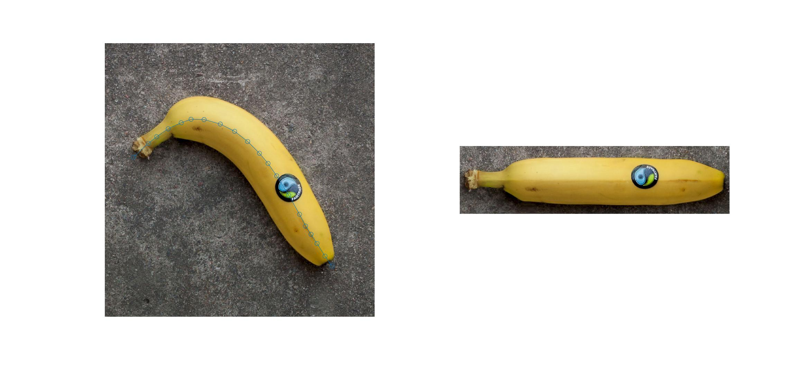

# Straighten
Straighten an image in Matlab

Based on the ImageJ Straighten function. ("Edit  ▶ Selection  ▶ Straighten...")

* [https://imagej.net/Straighten...](https://imagej.net/Straighten...)
* https://github.com/imagej/imagej1/blob/master/ij/plugin/Straightener.java#L101
* https://github.com/imagej/imagej1/blob/master/ij/gui/PolygonRoi.java#L1006

